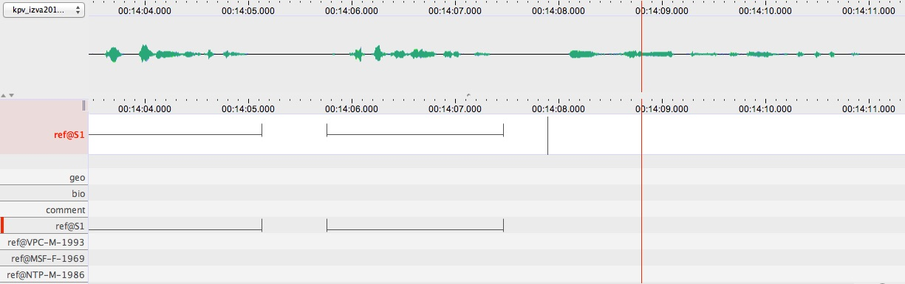

## Проектным

- Изьва диалектлӧн корпус
- Уджалам и важ и выль материалькӧд
- Дасьтам расшировкаяс, вуджӧдӧмъяс да мӧд типа аннотацияяс
- Быд гижӧдкӧд уна мета данные, важ материалькӧд тайӧс позьӧ корсьны либӧ реконструйтны

## Подув

Лингвистическӧй уджысь позьӧ торйӧдчыны некымын тшупӧд кодъяс вына йитчӧма ёрта-ёрткӧд:

- Материальӧн чукӧртчӧм
- Аннотация дасьтӧм (расшифровка, вуджӧдӧм, морфологическӧй туялӧм, аннотация вариация йылысь исв.)
- Метадата организируйтӧм
- Архивӧ пуктӧм
- Туялӧм

## Примеръяс миян уджаланногысь

Сегментацияыс позьӧ кокниа дасьтны ELAN:лӧн **режим сегментации** вылын.

<figure>
	
	<figcaption>Сегментация</figcaption>
</figure>

Расфировка и вуджӧдӧм позьӧ ставнас дасьтны **режим транскрипции** вылын.

Тайӧ материальысь позьӧ сразу корсьны ELAN пытшкын, например, формаяс контекстын:

Либӧ кывъяслӧн фреквенсъяс.

Дерт, гӧгӧрвоана мый унджык миян эм аннотация, унджык позьӧ корсьны. Сідз, эм кӧ морфология либӧ кывторъяс (part of speech) йылысь мыйкӧ пасйӧма, унджык позьӧ аддзыны.

## Ӧнія ситуация

- Выль стандардъяс (теорияын, практикаын, этикаын исв...)
- Выль технология

Найӧ кыкнаныс вежйӧны кыдзи уджалам - и тшӧтш мый позьӧ вӧчны.

Став уджаланногъяс гашкӧ абу нин дзик идеальнӧйӧсь.

## Чӧкыда вӧдитчӧмаӧсь торъяс

Чукӧртигӧн

 - Дигитальный диктофон
 - Видеокамераяс

Аннотация

 - ELAN, Praat, Exmeralda etc.

Метаданные

- Arbil

Архив

- Уна вариант, а .imdi либӧ .cmdi типа XML паськыда вӧдитчӧм стандард

Мыйӧн корсьны корпуссянь?

- ELAN пытшкын позьӧ корсьны, а тшӧтш позьӧ вӧдитчыны программаяс типа AntConc исв.
        
Ӧти юалӧм: Кыдз корсьны сідз мый йитчӧмаӧсь став информация аннотацияяс и метаданныесянь? R ӧтик позянлун та вылӧ.

## Мый ӧні на сьӧкыд

- Чукӧртчӧма материаль колӧ медводза синхронизируйтны, эм кӧ уна аудио трак и видео, этша информация тайӧ процес йылысь лингвистъяслы
- Кыдзи вӧдитчыны морфологическӧй аналызаторъяс ELAN файл пытшкын
        - Мед вӧчасны глоссъяс и видзӧдӧны гижанногсӧ
- Arbil зэв сьӧкыд мета данные понда - унаысь татшӧм типа информация кокниджык пасйыны реляционная база данных программаясын.
- ELAN экспортировать и импортировать зэв киӧн дасьтӧм удж - кыдз тайӧс кокниджыка вӧчны XSL-кӧд.

## Синхронизачия

Кыдз медся бура вӧдитчыны позянлунъяс кодъяс сетӧны торъя микрофонъяс, кыдз сійӧс оптимизировать мед кывзӧм медся бур?

## ELAN

Аннотация тшупӧд коді миян ӧні эм сетӧ нин позянлун туявны уна. Миян удж структура пытшкын эм нин ин тшӧтш морфологиялы, а вӧчны сійӧс киӧн абу практическӧй. Кыдз морфологическӧй анализируйтӧм вӧдитчыны?

Практическӧй тайӧс навернӧ позьӧ вӧчны абу ELAN пытшкын, а сразуджык сылӧн XML файлкӧд. Гашкӧ и правописаниесӧ позьӧ таті вӧдитчыны англи да роч кывъяскӧд?

## Метаданные

Тайӧ йылысь кута унджык пасйыны...